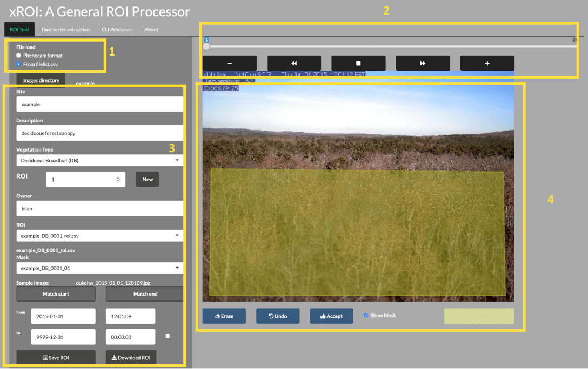
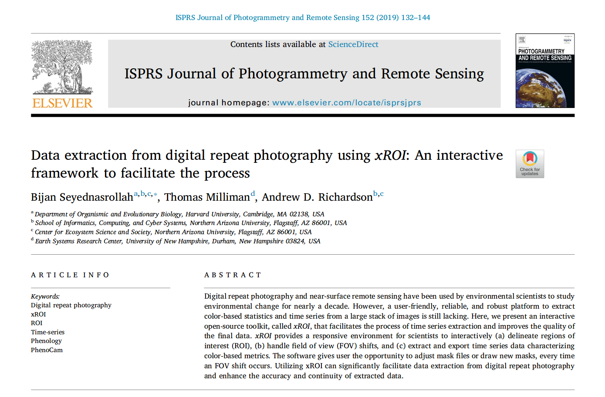

In this tutorial, we'll learn how to use an interactive open-source toolkit, the 
<a href="https://cran.r-project.org/web/packages/xROI/index.html" target="_blank">xROI R package</a>
 that facilitates the process of time series extraction and improves the quality 
 of the final data. The xROI package provides a responsive environment for 
 scientists to interactively:

a) delineate regions of interest (ROIs), 
b) handle field of view (FOV) shifts, and
c) extract and export time series data characterizing color-based metrics.

Using the *xROI* R package, the user can detect FOV shifts with minimal difficulty. 
The software gives user the opportunity to re-adjust mask files or redraw new 
ones every time an FOV shift occurs.



## xROI Design
The R language and Shiny package were used as the main development tool for xROI,
while Markdown, HTML, CSS and JavaScript languages were used to improve the 
interactivity. While Shiny apps are primarily used for web-based applications to 
be used online, the package authors used Shiny for its graphical user interface 
capabilities. In other words, both the User Interface (UI) and server modules are run 
locally from the same machine and hence no internet connection is required (after
installation). The xROI's UI element presents a side-panel for data entry and 
three main tab-pages, each responsible for a specific task. The server-side 
element consists of R and bash scripts. Image processing and geospatial features 
were performed using the `Geospatial Data Abstraction Library (GDAL)` and the 
`rgdal` and `raster` R packages. 

## Install xROI

The xROI R package has been published on The Comprehensive R Archive Network (CRAN). 
The latest tested xROI package can be installed from the 
<a href="https://cran.r-project.org/package=xROI" target="_blank">CRAN packages repository</a> by running the following command in an R environment. 


```r
utils::install.packages('xROI', repos = "http://cran.us.r-project.org" )
```

Alternatively, the latest beta release of xROI can be directly downloaded and 
installed from the development GitHub repository. 


```r
# install devtools first
utils::install.packages('devtools', repos = "http://cran.us.r-project.org" )

# use devtools to install from GitHub
devtools::install_github("bnasr/xROI")
```

xROI depends on many R packages including: `raster`, `rgdal`, `sp`, `jpeg`, 
`tiff`, `shiny`, `shinyjs`, `shinyBS`, `shinyAce`, `shinyTime`, `shinyFiles`, 
`shinydashboard`, `shinythemes`, `colourpicker`, `rjson`, `stringr`, `data.table`, 
`lubridate`, `plotly`, `moments`, and `RCurl`. All the required libraries and 
packages will be automatically installed with installation of *xROI*. The package 
offers a fully interactive high-level interface as well as a set of low-level 
functions for ROI processing. 

## Launch xROI

A comprehensive user manual for low-level image processing using *xROI* is available from 
<a href="https://cran.r-project.org/package=xROI/xROI.pdf" target="_blank">CRAN xROI.pdf</a>. 
While the user manual includes a set of examples for each function; here we 
will learn to use the graphical interactive mode. 

Calling the `Launch()` function, as we'll do below, opens up the interactive 
mode in your operating system’s default web browser. The landing page offers an 
example dataset to explore different modules or upload a new dataset of images. 

You can launch the interactive mode can be launched from an interactive R environment.


```r
# load xROI
library(xROI)

# launch xROI 
Launch()
```

Or from the command line (e.g. bash in Linux, Terminal in macOS and Command 
Prompt in Windows machines) where an R engine is already installed.


```bash

Rscript -e “xROI::Launch(Interactive = TRUE)”

```


## End xROI

When you are done with the xROI interface you can close the tab in your browser 
and end the session in R by using one of the following options

**In RStudio:** Press the <Esc> key on your keyboard.
**In R Terminal:** Press <Ctrl + C> on your keyboard.

## Use xROI 

To get some hands-on experience with `xROI`, we can analyze images from the 
<a href="https://phenocam.sr.unh.edu/webcam/sites/dukehw/">dukehw</a> 
of the PhenoCam network. 

You can download the data set from 
<a href="http://bit.ly/2PzZ2fL">this link (direct download)</a>. 

Follow the steps below:

First,save and extract (unzip) the file on your computer. 

Second, open the data set in `xROI` by setting the file path to your data


```r
# launch data in ROI
# first edit the path below to the dowloaded directory you just extracted
xROI::Launch('/path/to/extracted/directory')

# alternatively, you can run without specifying a path and use the interface to browse 
```

Now, draw an ROI and the metadata. 

Then, save the metadata and explore its content.

Now we can explore if there is any FOV shift in the dataset using the `CLI processer` tab.

Finally, we can go to the `Time series extraction` tab. Extract the time-series. Save the output and explore the dataset in R.


## Documentation and Citation

More documentation about **xROI** can be found from: <a href="https://bnasr.github.io/papers/Seyednasrollah_et_al_2019_PRS.pdf">Seyednarollah, et al. 2019</a>. 




## Challenge: Use xROI

Let's use xROI on a little more challenging site with field of view shifts. 

Download and extract the data set from 
<a href="http://bit.ly/2DrZgA1">this link (direct download, 218 MB)</a> 
and follow the above steps to extract the time-series.
</div>


*** 

The *xROI* R package is developed and maintained by 
<a href="https://bnasr.github.io/">Bijan Seyednarollah</a>. 
The most recent release is available from <a href="https://github.com/bnasr/xROI" target="_blank">https://github.com/bnasr/xROI</a>.
